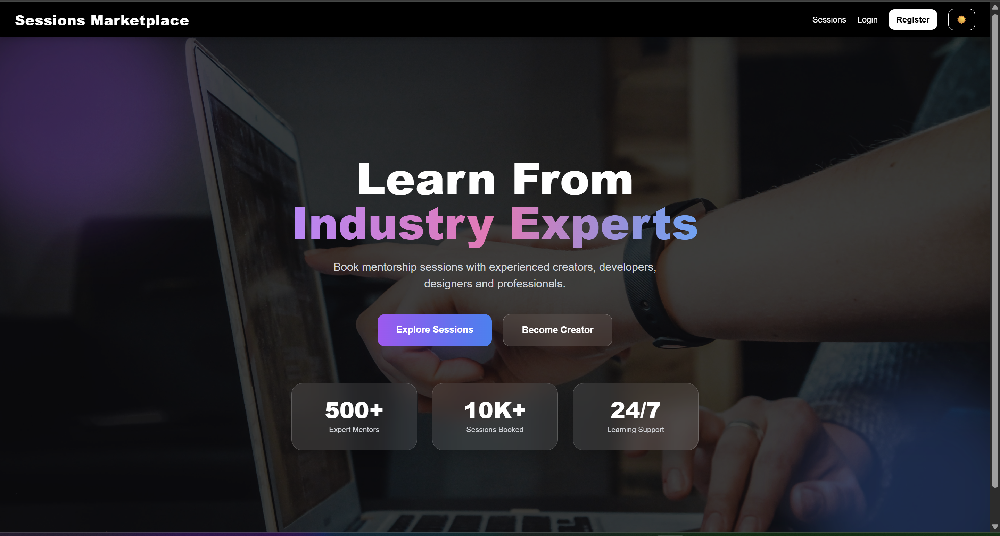
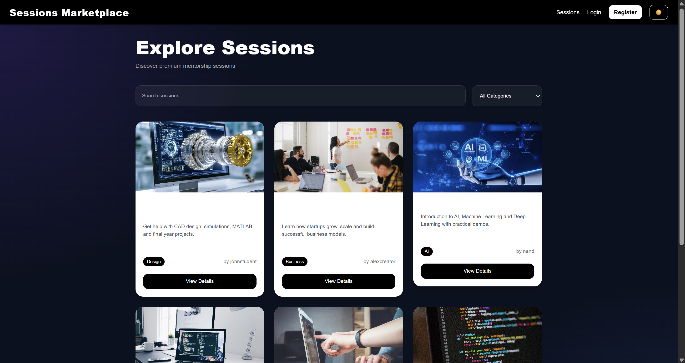
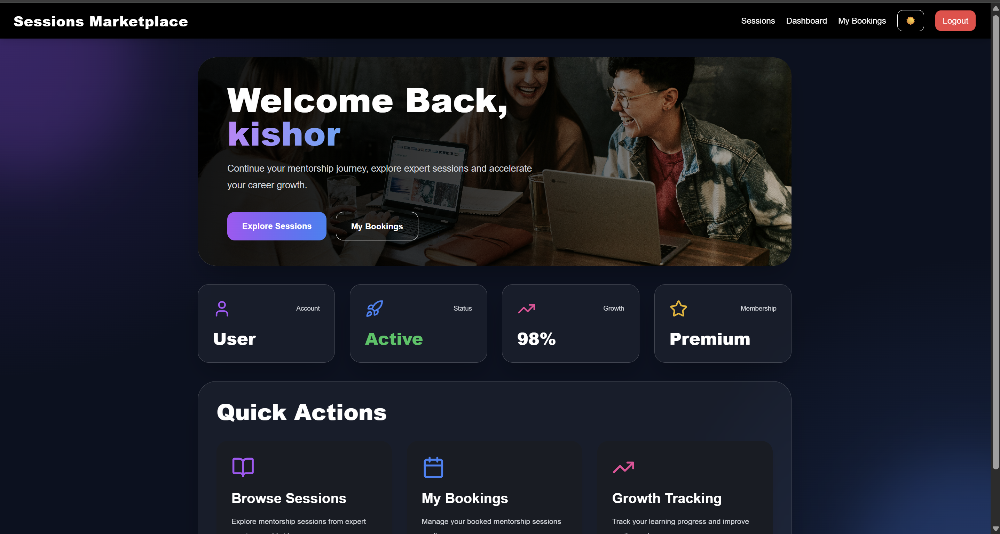
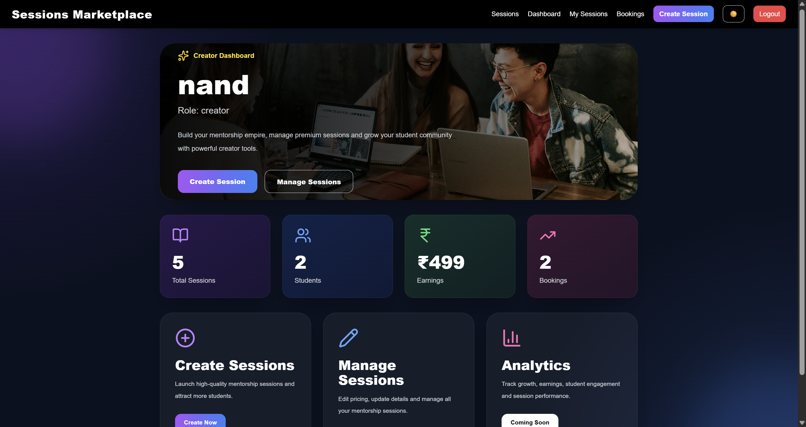
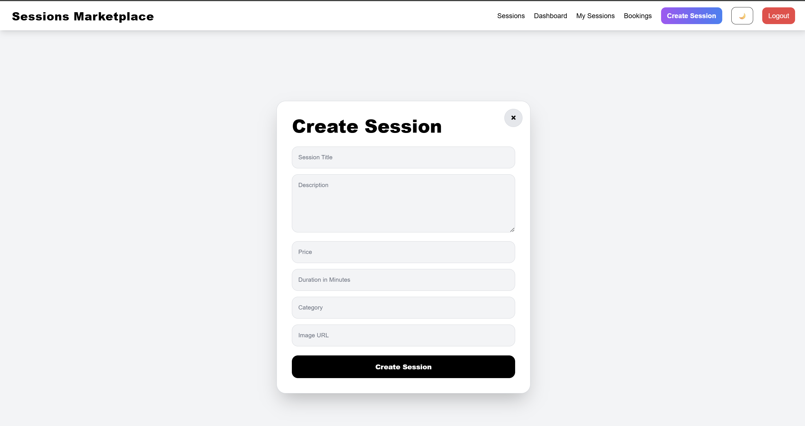
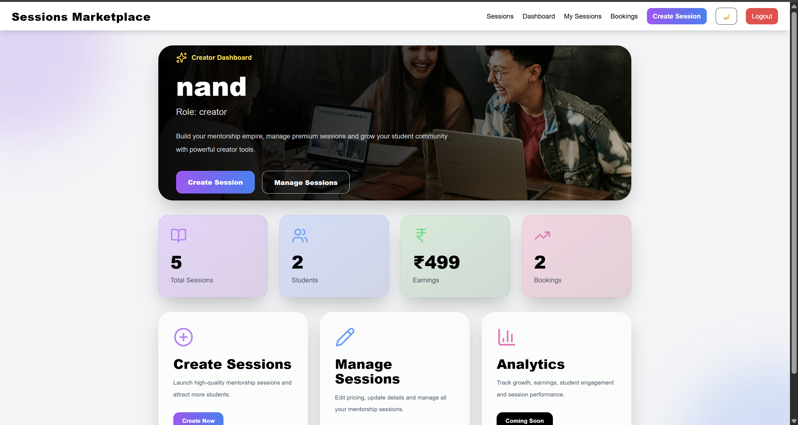

# Sessions Marketplace

Sessions Marketplace is a full stack mentorship marketplace platform where creators can publish mentorship sessions and users can browse and book those sessions.

The project was built using React, Django REST Framework, PostgreSQL, and Docker as part of a Full Stack Developer  Assignment.

The main goal of this project was to build a real-world marketplace application with authentication, role-based access, booking workflow, responsive dashboards, and API integration while maintaining a clean and modern UI experience.

---

# Platform Overview

The platform supports two main roles:

- User
- Creator

Both roles have different navigation flows, dashboards, permissions, and functionality.

The complete user experience starts from the homepage and continues until session booking and booking management.

---

# Homepage Experience

The homepage is the first page users see after opening the platform.

The goal of the homepage was to:

- introduce the platform
- showcase mentorship sessions
- provide quick navigation
- improve user engagement
- support both creators and learners

The homepage includes:

- responsive hero section
- featured mentorship sessions
- platform feature sections
- creator-focused section
- dark/light mode support
- animated UI sections

Framer Motion animations and gradients were added to improve interaction experience while maintaining responsiveness.

---

# Guest User Flow

When a guest user opens the platform:

1. User lands on homepage
2. Featured mentorship sessions are displayed
3. User can explore sessions
4. User can register or login
5. Protected pages remain inaccessible until authentication

The onboarding flow was designed to remain simple and clear.

---

# Authentication System

Authentication is implemented using JWT tokens.

Authentication flow:

1. User registers or logs in
2. Backend generates JWT token
3. Token is stored in local storage
4. Frontend sends token with API requests
5. Protected routes validate authentication

This allows secure communication between frontend and backend APIs.

The platform supports:

- Login
- Register
- Persistent authentication
- Protected routes
- Role-based access control

---

# User Experience

After user login, the navigation bar updates dynamically.

Users can access:

- Home
- Sessions
- My Bookings
- Dashboard
- Logout

The sessions marketplace acts as the core learning section of the platform.

Users can:

- browse mentorship sessions
- search sessions
- filter sessions by category
- open detailed session pages
- book mentorship sessions
- manage bookings

---

# Sessions Marketplace

The sessions page was designed similar to real marketplace applications.

Each session card contains:

- session image
- title
- creator name
- category
- price
- duration

Responsive cards were implemented for:

- desktop screens
- tablets
- mobile devices

Search and filtering were added to improve session discovery as the number of sessions increases.

Pagination support was also added to improve frontend performance.

---

# Session Details Page

Each mentorship session has a dedicated details page.

The details page contains:

- session image
- detailed description
- creator information
- price
- duration
- related sessions
- booking functionality

The goal was to provide users all important information before booking a mentorship session.

---

# Booking Flow

When a user clicks the booking button:

1. Request is sent to backend API
2. Backend validates booking request
3. Duplicate bookings are prevented
4. Booking record is created
5. Booking appears in user dashboard
6. Booking appears in creator dashboard

The booking flow was designed similar to real mentorship marketplace systems.

---

# User Dashboard

The user dashboard allows users to manage learning activity and bookings.

Users can:

- view booking history
- manage booked sessions
- cancel bookings
- track activity

Responsive dashboard cards and tables were added for better mobile experience.

---

# Creator Experience

Creators can register using creator role during signup.

After creator login, the navbar updates dynamically and displays:

- Home
- Sessions
- Create Session
- My Sessions
- Creator Dashboard
- Creator Bookings
- Logout

The creator workflow was designed to make mentorship management simple and scalable.

---

# Create Session Flow

Creators can publish mentorship sessions directly from the platform.

The session creation form includes:

- title
- description
- category
- price
- duration
- image URL

Frontend and backend validation were implemented to prevent invalid data.

Validation includes:

- required fields
- minimum title length
- positive price validation
- positive duration validation
- image URL validation

After successful creation:

- session is stored in database
- session appears in marketplace
- session appears in creator dashboard

---

# Manage Sessions

Creators can:

- edit sessions
- delete sessions
- manage sessions
- open session details

The edit page includes:

- responsive layout
- validation handling
- image preview
- dark mode support

---

# Creator Dashboard

The creator dashboard acts as the management center for mentors.

Creators can track:

- total sessions
- total students
- total bookings
- total earnings

The dashboard also provides quick navigation for:

- creating sessions
- managing sessions
- opening creator bookings

Analytics cards and gradients were added to improve presentation and usability.

---

# Creator Bookings

Creators can manage all student bookings from creator bookings page.

Bookings are grouped by sessions.

For every session creators can view:

- student name
- booking date
- booking status
- session earnings

Pagination support was implemented to handle larger numbers of bookings efficiently.

Responsive tables were added for smaller screens and mobile devices.

---

# Responsive Design

A major focus during development was responsive design.

The desktop layout was preserved while improving mobile usability.

Responsive improvements include:

- responsive navbar
- responsive session cards
- responsive booking tables
- responsive dashboards
- responsive forms
- optimized mobile spacing

The platform was tested for:

- mobile devices
- tablets
- laptops
- desktop screens

---

# Dark / Light Mode

Dark and light theme support was implemented using Tailwind CSS dark classes and React Context API.

Theme preference is stored in local storage.

Several dark mode refinements were made during development to:

- reduce excessive black backgrounds
- improve readability
- improve contrast
- maintain modern UI appearance

---

# Pagination & Performance

Pagination and lazy loading concepts were implemented to improve scalability and frontend performance.

Pagination was added for:

- sessions page
- user bookings
- creator bookings

This prevents loading large amounts of data at once and improves rendering performance.

---

# Validation & Error Handling

Both frontend and backend validation were implemented.

Frontend validation includes:

- required fields
- positive number validation
- minimum title length
- image URL validation

Backend validation includes:

- serializer validation
- duplicate booking prevention
- protected API validation

Error handling was also implemented for:

- invalid login credentials
- unauthorized access
- duplicate bookings
- invalid session updates
- validation failures

Toast notifications are used for displaying success and error messages.

---

# Frontend Architecture

The frontend was built using React and Tailwind CSS.

The frontend structure includes reusable sections such as:

- Navbar
- Session cards
- Dashboard cards
- Protected routes
- Responsive layouts

React Context API is used for:

- authentication state
- theme management
- global user information

Framer Motion was used for animations and UI transitions.

---

# Backend Architecture

The backend was built using Django REST Framework.

The backend is divided into separate Django apps.

## authentication/

Handles:

- login
- register
- JWT token generation

---

## sessions/

Handles:

- session CRUD operations
- session filtering
- session management

---

## bookings/

Handles:

- booking creation
- booking cancellation
- creator analytics
- user booking history

---

# Database Design

PostgreSQL was used as the primary database.

Main entities used in the platform:

## User

Stores:

- username
- email
- password
- role

---

## Session

Stores:

- title
- description
- category
- price
- duration
- image
- creator

---

## Booking

Stores:

- booked user
- booked session
- booking status
- booking date

---

# Technical Stack

## Frontend

- React
- Tailwind CSS
- Axios
- React Router
- Framer Motion

---

## Backend

- Django
- Django REST Framework
- JWT Authentication

---

## Database

- PostgreSQL

---

## Infrastructure

- Docker
- Docker Compose
- Nginx

---

# API Overview

| Endpoint | Method | Description |
|---|---|---|
| /api/auth/register/ | POST | Register user |
| /api/auth/login/ | POST | Login user |
| /api/sessions/ | GET | Get all sessions |
| /api/sessions/create/ | POST | Create session |
| /api/sessions/update/:id/ | PUT | Update session |
| /api/bookings/create/:id/ | POST | Book session |
| /api/bookings/my-bookings/ | GET | User bookings |
| /api/bookings/creator-bookings/ | GET | Creator bookings |

---

# Backend Setup

Move to backend folder:

```bash
cd backend
```

Create virtual environment:

```bash
python -m venv venv
```

Activate environment:

```bash
venv\Scripts\activate
```

Install dependencies:

```bash
pip install -r requirements.txt
```

Apply migrations:

```bash
python manage.py migrate
```

Run backend server:

```bash
python manage.py runserver
```

Backend runs on:

```bash
http://127.0.0.1:8000
```

---

# Frontend Setup

Move to frontend folder:

```bash
cd frontend
```

Install dependencies:

```bash
npm install
```

Run frontend:

```bash
npm run dev
```

Frontend runs on:

```bash
http://localhost:5173
```

---

# Docker Setup

Docker support was added to simplify deployment and maintain consistent environments.

The application can be containerized using:

- frontend container
- backend container
- PostgreSQL container
- Nginx container

Build and start containers:

```bash
docker-compose up --build
```

Stop containers:

```bash
docker-compose down
```

---

# Environment Variables

Environment variables are managed using `.env` files.

Sensitive credentials such as:

- secret keys
- database passwords
- API keys

are not included in this repository.

---

# Screenshots

## Homepage

The homepage introduces the platform with featured mentorship sessions, responsive hero section, and dark/light mode support.





---

## Sessions Page

Displays all available mentorship sessions with search, filters, responsive cards, and pagination.





---

## Session Details Page

Detailed mentorship session page with booking functionality and related sessions.


---

## User Dashboard

Dashboard for users to manage bookings and learning activity.





---

## Creator Dashboard

Creator analytics dashboard with earnings overview, session statistics, and quick management actions.





---

## Creator Bookings

Displays grouped bookings with responsive tables and pagination support.





---

## Light Mode

The application also supports Light mode UI across all pages.





---

# Challenges Faced

Some challenges faced during development included:

- handling role-based navigation
- synchronizing frontend and backend validation
- improving responsive booking tables
- implementing pagination for bookings
- debugging JWT authentication flow
- handling API update validation issues

Several UI and backend refinements were made during development to improve usability and scalability.

---

# Learnings

This project improved my understanding of:

- full stack application architecture
- REST API integration
- JWT authentication
- React state management
- responsive frontend design
- Django REST Framework
- Docker basics
- pagination and lazy loading

It also improved debugging and problem-solving skills while handling authentication, responsive layouts, and booking logic.

---

# Test Accounts

## Creator Account

```text
username: alexcreator
password: alex12345
```

---

## User Account

```text
username: johnstudent
password: john12345
```

---

# Future Improvements

Some features that can be added in future:

- payment gateway integration
- video meeting integration
- notifications
- reviews and ratings
- chat system

---

# Author

Nandkishor Kumar Pandit

Full Stack Developer Internship Assignment
